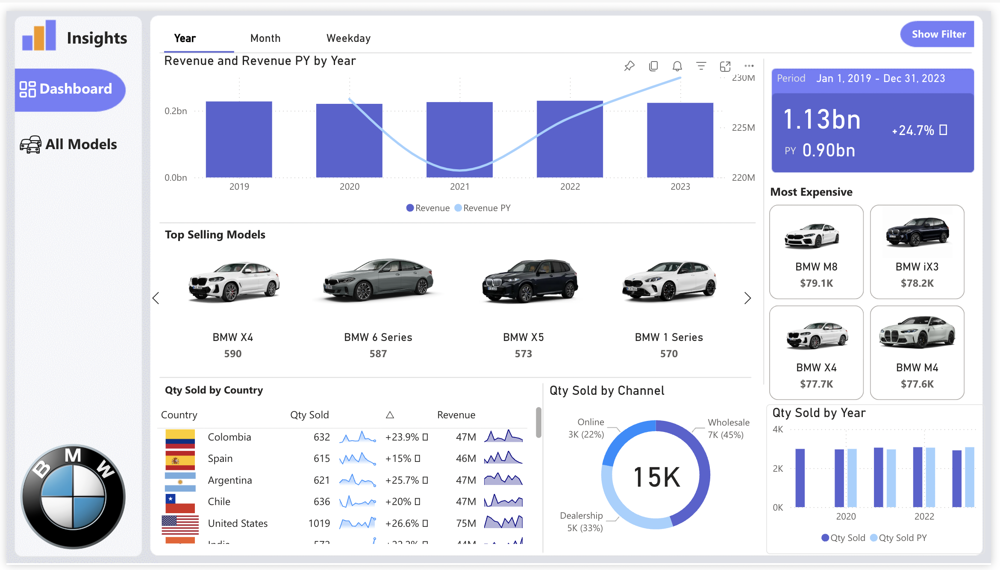
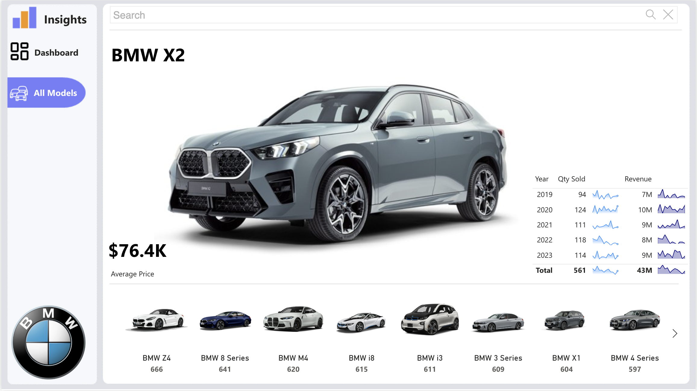

# 🚘 BMW Sales Analysis Dashboard (Power BI)

This project showcases a fully interactive **Power BI dashboard** that provides a comprehensive analysis of BMW's global sales and revenue data from **2019 to 2024**, covering over **$1.13 billion** in total value.

## 📊 Overview
This report allows users to:
- Analyze **year-over-year trends** in revenue and units sold
- Explore **top-selling BMW models** and their regional performance
- Identify **most expensive models** and compare average selling prices
- Filter results by **year, month, weekday**, and **sales channels**
- Review **country-level performance** across more than **25 regions**

## 🛠️ Features & Tools
- Built in **Power BI Desktop**
- Interactive filters, slicers, and **page navigation**
- Custom **3D car images** for enhanced visual storytelling
- KPI cards, sparklines, pie charts, bar graphs, and more
- Powered by **DAX measures** and calculated columns

## 📽️ Demo Video
🎥 [BMW_Sales_Recording.mp4](#)  

## 📸 Preview
### Dashboard Overview

### Model Drill-Down Page

## 📂 Files Included
- `BMW_Tutorial.pbix` – Full Power BI report file
- `Screen Recording.mov` – Walkthrough of the dashboard features
- Project screenshots

## 📌 How to Use
1. Download the `.pbix` file from this repository
2. Open it using [Power BI Desktop](https://powerbi.microsoft.com/desktop/)
3. Interact with visuals, filters, and slicers to explore the data

## 📈 Key Insights
- Total Revenue (2019–2024): **$1.13bn** (+24.7% from previous years)
- Highest-selling model: **BMW X4 (590 units)**
- Strongest regional growth in: **India (+26.6%)** and **Argentina (+25.7%)**
- Leading channel: **Wholesale (45%)**

## 🧠 Skills Demonstrated
- Data visualization & storytelling
- DAX formulas and calculated measures
- Visual design and UX optimization
- Dashboard interactivity and navigation logic

---
